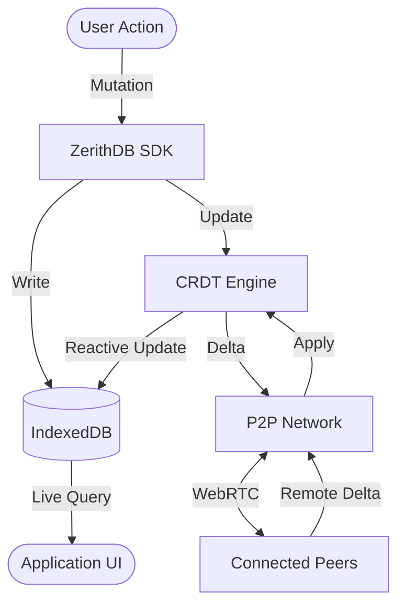

# `zerithdb-sdk`

The **ZerithDB SDK** is the primary entry point for building local-first, peer-to-peer applications.
It orchestrates the database, synchronization engine, authentication manager, and network layer into
a single, easy-to-use client.

[](https://www.npmjs.com/package/zerithdb-sdk)
[](../../LICENSE)

## 📦 Installation

```bash
npm install zerithdb-sdk
```

## 🚀 Quick Start

```typescript
import { createApp } from "zerithdb-sdk";

// 1. Initialize the app
const app = createApp({
  appId: "my-awesome-app",
  sync: { signalingUrl: "wss://signal.zerithdb.dev" },
});

// 2. Write data — persisted locally to IndexedDB immediately
const todos = app.db("todos");
await todos.insert({ text: "Build something great", done: false });

// 3. Enable P2P sync — connect to peers and share updates
app.sync.enable();

// 4. Reactive subscriptions
todos.subscribe((allTodos) => {
  console.log("Updated todos:", allTodos);
});
```

## 🛠️ Core API Reference

### `createApp(config)`

Initializes a new ZerithDB instance.

| Option              | Type     | Default                       | Description                                           |
| :------------------ | :------- | :---------------------------- | :---------------------------------------------------- |
| `appId`             | `string` | **Required**                  | Unique namespace for your app's data.                 |
| `sync.signalingUrl` | `string` | `"wss://signal.zerithdb.dev"` | WebSocket URL for the signaling server.               |
| `sync.maxPeers`     | `number` | `10`                          | Maximum number of concurrent peer connections.        |
| `auth.storageKey`   | `string` | `"__zerithdb_identity"`       | Key used to store identity in localStorage.           |
| `logLevel`          | `string` | `"warn"`                      | Console log level (`debug`, `info`, `warn`, `error`). |

### Database Operations (`app.db(name)`)

Returns a collection handle for performing CRUD operations.

- **`insert(doc)`**: Adds a new document. Returns `{ id }`.
- **`find(filter)`**: Queries documents using MongoDB-style filters (e.g., `{ status: "active" }`).
- **`update(filter, spec)`**: Updates matching documents (e.g., `{ $set: { done: true } }`).
- **`delete(filter)`**: Removes matching documents.
- **`subscribe(callback)`**: Listens for changes and triggers on every local or remote update.

### Sync API (`app.sync`)

Manages the CRDT synchronization engine.

- **`enable()`**: Starts the P2P synchronization process.
- **`forceSync()`**: Manually triggers an immediate synchronization cycle.
- **`flush()`**: Forces a push of all pending local updates to connected peers.

> For advanced sync strategies, see the [FORCE_SYNC.md](./FORCE_SYNC.md) guide.

### Auth API (`app.auth`)

Handles self-sovereign identity using Ed25519 keypairs.

- **`signIn()`**: Loads an existing identity from storage or generates a new one.
- **`signOut()`**: Clears the local identity.
- **`get identity`**: Returns the current `Identity` (publicKey, etc.).

## 🔌 Framework Integration

### React

```tsx
import { ZerithProvider } from "zerithdb-react";

function Root() {
  return (
    <ZerithProvider config={{ appId: "my-app" }}>
      <App />
    </ZerithProvider>
  );
}
```

### Vanilla JS

```javascript
import { createApp } from "zerithdb-sdk";
const app = createApp({ appId: "my-app" });
```

### Python

```python
from zerithdb import ZerithClient
db = ZerithClient(signaling_url="wss://signal.zerithdb.dev")
await db.connect("my-app")
```

## 🏗️ Architecture Overview

ZerithDB follows a **thick-client, local-first architecture**. Unlike traditional web apps that
treat the browser as a thin view into a central database, ZerithDB moves the database,
synchronization logic, and networking directly into the client.

### Core Components

- **CRDT Engine (Yjs)**: The heart of ZerithDB. Every collection is backed by a Yjs `Y.Doc`. This
  ensures that concurrent edits from multiple peers always converge to the same state without a
  central authority.
- **IndexedDB (Dexie)**: Provides persistent, high-performance local storage. All writes are
  synchronous to IndexedDB first, ensuring 0ms latency and full offline capability.
- **WebRTC Mesh**: Direct peer-to-peer data channels via `simple-peer`. Peers form a resilient mesh
  network to propagate CRDT updates with minimal latency.
- **Signaling Service**: A lightweight WebSocket relay used _only_ for initial peer discovery and
  the WebRTC handshake. Once connected, peers communicate directly.

### Data Flow



## ❓ Troubleshooting

Common issues and their solutions can be found in our
[Troubleshooting Guide](https://zerithdb.netlify.app/docs/troubleshooting).

### Common Scenarios

- **Connection Fails**: Ensure your signaling URL is reachable. If you're behind a strict corporate
  firewall, you may need to configure custom
  [ICE servers](https://zerithdb.netlify.app/docs/troubleshooting#webrtc-nat-issue).
- **Persistence Issues**: ZerithDB requires IndexedDB. Ensure your browser is not in a restricted
  "Private/Incognito" mode that disables storage.

## 🤝 Contributing

Contributions are welcome! Please see [CONTRIBUTING.md](../../CONTRIBUTING.md) for details on how to
get started.

## 📄 License

Licensed under the [Apache License, Version 2.0](../../LICENSE).
